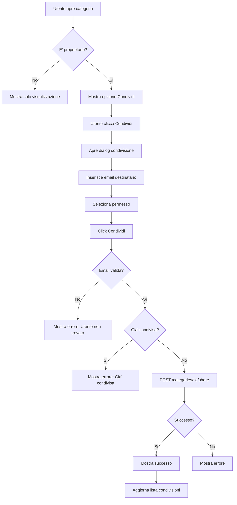
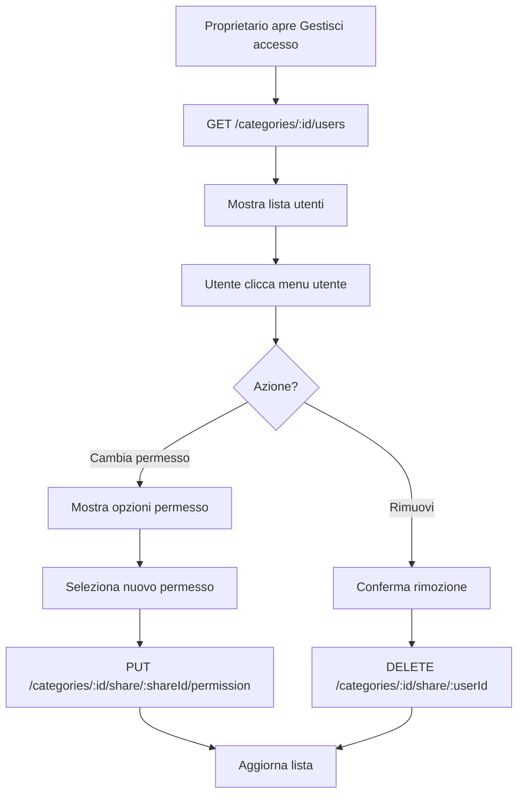
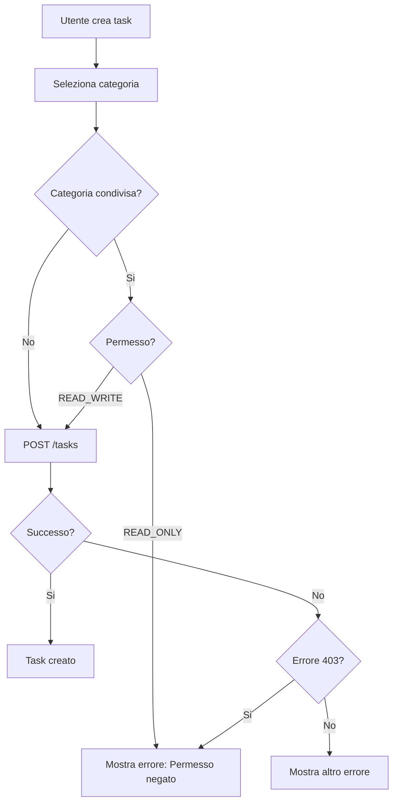

# Documentazione Client - Condivisione Categorie

## Indice
1. [Panoramica](#panoramica)
2. [Endpoints API](#endpoints-api)
3. [Modelli Dati](#modelli-dati)
4. [Implementazione UI](#implementazione-ui)
5. [Flussi Utente](#flussi-utente)
6. [Esempi di Codice](#esempi-di-codice)
7. [Gestione Errori](#gestione-errori)
8. [Best Practices](#best-practices)

---

## Panoramica

La funzionalità di condivisione categorie permette agli utenti di collaborare condividendo le proprie categorie di task con altri utenti. Esistono due livelli di permessi:

- **READ_ONLY**: L'utente può visualizzare la categoria e i task, ma non può modificarli
- **READ_WRITE**: L'utente può creare, modificare ed eliminare task nella categoria condivisa

Solo il proprietario della categoria può:
- Condividerla con altri utenti
- Modificare i permessi degli utenti
- Rimuovere utenti dalla condivisione
- Eliminare la categoria

---

## Endpoints API

### Base URL
```
https://api.mytasklyapp.com
```

### Autenticazione
Tutti gli endpoint richiedono un token JWT nell'header:
```http
Authorization: Bearer <your_jwt_token>
```

---

### 1. Ottenere Tutte le Categorie (Possedute + Condivise)

**Endpoint**: `GET /categories`

**Response**:
```json
[
  {
    "category_id": 1,
    "name": "Lavoro",
    "description": "Task lavorativi",
    "user_id": 38,
    "is_shared": true,
    "owner_id": 38,
    "is_owned": true,
    "permission_level": "READ_WRITE"
  },
  {
    "category_id": 5,
    "name": "Progetto Team",
    "description": "Categoria condivisa dal team",
    "user_id": 42,
    "is_shared": true,
    "owner_id": 42,
    "is_owned": false,
    "permission_level": "READ_ONLY"
  }
]
```

**Campi Importanti**:
- `is_owned`: `true` se l'utente è il proprietario, `false` se condivisa
- `permission_level`: Il livello di permesso dell'utente corrente
- `owner_id`: ID del proprietario originale

---

### 2. Condividere una Categoria

**Endpoint**: `POST /categories/{category_id}/share`

**Permessi Richiesti**: Solo il proprietario

**Request Body**:
```json
{
  "user_email": "colleague@example.com",
  "permission": "READ_WRITE"
}
```

**Response** (Success):
```json
{
  "message": "Category shared successfully",
  "share_id": 123,
  "shared_with": "Marco Rossi"
}
```

**Response** (Error - Non proprietario):
```json
{
  "detail": "Only the category owner can share it"
}
```

---

### 3. Ottenere Lista Condivisioni di una Categoria

**Endpoint**: `GET /categories/{category_id}/shares`

**Permessi Richiesti**: Qualsiasi utente con accesso alla categoria

**Response**:
```json
[
  {
    "share_id": 123,
    "category_id": 1,
    "category_name": "Lavoro",
    "owner_id": 38,
    "shared_with_user_id": 42,
    "shared_with_user_name": "Marco Rossi",
    "shared_with_user_email": "marco@example.com",
    "permission_level": "READ_WRITE",
    "shared_at": "2025-10-02T10:30:00Z",
    "accepted": true
  }
]
```

---

### 4. Rimuovere Condivisione

**Endpoint**: `DELETE /categories/{category_id}/share/{share_user_id}`

**Permessi Richiesti**: Solo il proprietario

**Response**:
```json
{
  "message": "Category share removed successfully"
}
```

---

### 5. Aggiornare Permessi Condivisione

**Endpoint**: `PUT /categories/{category_id}/share/{share_id}/permission`

**Permessi Richiesti**: Solo il proprietario

**Query Parameter**:
```
?permission=READ_ONLY
```

**Response**:
```json
{
  "message": "Permission updated successfully",
  "new_permission": "READ_ONLY"
}
```

---

### 6. Ottenere Categorie Condivise con Me

**Endpoint**: `GET /categories/shared-with-me`

**Response**:
```json
[
  {
    "category_id": 5,
    "name": "Progetto Team",
    "description": "Categoria del team marketing",
    "owner_id": 42,
    "owner_name": "Laura Bianchi",
    "permission_level": "READ_WRITE",
    "shared_at": "2025-10-01T15:20:00Z"
  }
]
```

---

### 7. Ottenere Tutti gli Utenti con Accesso

**Endpoint**: `GET /categories/{category_id}/users`

**Permessi Richiesti**: Qualsiasi utente con accesso alla categoria

**Response**:
```json
[
  {
    "user_id": 38,
    "name": "Gab",
    "email": "gab@example.com",
    "permission_level": "READ_WRITE",
    "shared_at": "2025-10-02T10:00:00Z"
  },
  {
    "user_id": 42,
    "name": "Marco Rossi",
    "email": "marco@example.com",
    "permission_level": "READ_ONLY",
    "shared_at": "2025-10-02T10:30:00Z"
  }
]
```

---

## Modelli Dati

### CategoryDTO (TypeScript/JavaScript)

```typescript
interface Category {
  category_id: number;
  name: string;
  description: string | null;
  user_id: number;
  is_shared: boolean;
  owner_id: number | null;
  is_owned: boolean;
  permission_level: "READ_ONLY" | "READ_WRITE";
}

interface CategoryShare {
  share_id: number;
  category_id: number;
  category_name: string;
  owner_id: number;
  shared_with_user_id: number;
  shared_with_user_name: string;
  shared_with_user_email: string;
  permission_level: "READ_ONLY" | "READ_WRITE";
  shared_at: string; // ISO 8601 datetime
  accepted: boolean;
}

interface UserShareInfo {
  user_id: number;
  name: string;
  email: string;
  permission_level: "READ_ONLY" | "READ_WRITE";
  shared_at: string; // ISO 8601 datetime
}

interface ShareCategoryRequest {
  user_email: string;
  permission: "READ_ONLY" | "READ_WRITE";
}
```

---

## Implementazione UI

### Componenti UI Necessari

#### 1. **Lista Categorie con Indicatori**

Visualizzare le categorie con indicatori visivi:
- Icona "proprietario" per categorie possedute
- Icona "condivisa" per categorie condivise con l'utente
- Badge con permesso (READ_ONLY / READ_WRITE)
- Icona "lucchetto" per categorie READ_ONLY

```
┌─────────────────────────────────────┐
│ 📁 Lavoro                    [TUE]  │ <- Categoria posseduta
│ Categoria lavorativa                │
│ 👥 Condivisa con 3 persone          │
└─────────────────────────────────────┘

┌─────────────────────────────────────┐
│ 📁 Progetto Team        [READ_ONLY] │ <- Categoria condivisa
│ Condivisa da: Laura Bianchi   🔒    │
└─────────────────────────────────────┘
```

#### 2. **Dialog Condivisione Categoria**

Un dialog per condividere la categoria con altri utenti:

```
┌─────────────────────────────────────┐
│  Condividi "Lavoro"                │
│                                     │
│  Email utente:                      │
│  ┌───────────────────────────────┐ │
│  │ user@example.com              │ │
│  └───────────────────────────────┘ │
│                                     │
│  Permessi:                          │
│  ○ Sola lettura (READ_ONLY)        │
│  ● Lettura e scrittura (READ_WRITE)│
│                                     │
│  [Annulla]  [Condividi]            │
└─────────────────────────────────────┘
```

#### 3. **Lista Utenti con Accesso**

Visualizzare chi ha accesso alla categoria:

```
┌─────────────────────────────────────┐
│  Utenti con accesso                 │
│                                     │
│  👤 Gab (Tu)                        │
│     Proprietario                    │
│                                     │
│  👤 Marco Rossi                     │
│     marco@example.com               │
│     READ_WRITE              [...]   │ <- Menu opzioni
│                                     │
│  👤 Laura Bianchi                   │
│     laura@example.com               │
│     READ_ONLY               [...]   │
│                                     │
│  [+ Aggiungi persona]               │
└─────────────────────────────────────┘
```

#### 4. **Menu Contestuale Categoria**

Opzioni diverse in base ai permessi:

**Se proprietario**:
```
┌────────────────────┐
│ ✏️  Modifica        │
│ 👥 Gestisci accesso │
│ 🗑️  Elimina         │
└────────────────────┘
```

**Se READ_WRITE**:
```
┌────────────────────┐
│ ➕ Nuovo task      │
│ 🚪 Esci            │
└────────────────────┘
```

**Se READ_ONLY**:
```
┌────────────────────┐
│ 👁️  Solo lettura   │
│ 🚪 Esci            │
└────────────────────┘
```

---

## Flussi Utente

### Flusso 1: Condividere una Categoria



### Flusso 2: Gestire Permessi Utente



### Flusso 3: Creare Task in Categoria Condivisa



---

## Esempi di Codice

### JavaScript/React

#### Service per API Calls

```javascript
// services/categoryShareService.js
import axios from 'axios';

const API_BASE = 'https://api.mytasklyapp.com';

class CategoryShareService {
  constructor(authToken) {
    this.authToken = authToken;
    this.headers = {
      'Authorization': `Bearer ${authToken}`,
      'Content-Type': 'application/json'
    };
  }

  async getCategories() {
    try {
      const response = await axios.get(`${API_BASE}/categories`, {
        headers: this.headers
      });
      return response.data;
    } catch (error) {
      throw this.handleError(error);
    }
  }

  async shareCategory(categoryId, userEmail, permission = 'READ_ONLY') {
    try {
      const response = await axios.post(
        `${API_BASE}/categories/${categoryId}/share`,
        { user_email: userEmail, permission },
        { headers: this.headers }
      );
      return response.data;
    } catch (error) {
      throw this.handleError(error);
    }
  }

  async getCategoryShares(categoryId) {
    try {
      const response = await axios.get(
        `${API_BASE}/categories/${categoryId}/shares`,
        { headers: this.headers }
      );
      return response.data;
    } catch (error) {
      throw this.handleError(error);
    }
  }

  async removeShare(categoryId, userId) {
    try {
      const response = await axios.delete(
        `${API_BASE}/categories/${categoryId}/share/${userId}`,
        { headers: this.headers }
      );
      return response.data;
    } catch (error) {
      throw this.handleError(error);
    }
  }

  async updateSharePermission(categoryId, shareId, permission) {
    try {
      const response = await axios.put(
        `${API_BASE}/categories/${categoryId}/share/${shareId}/permission?permission=${permission}`,
        {},
        { headers: this.headers }
      );
      return response.data;
    } catch (error) {
      throw this.handleError(error);
    }
  }

  async getSharedWithMe() {
    try {
      const response = await axios.get(
        `${API_BASE}/categories/shared-with-me`,
        { headers: this.headers }
      );
      return response.data;
    } catch (error) {
      throw this.handleError(error);
    }
  }

  handleError(error) {
    if (error.response) {
      return {
        message: error.response.data.detail || 'Errore sconosciuto',
        status: error.response.status
      };
    }
    return { message: 'Errore di connessione', status: 0 };
  }
}

export default CategoryShareService;
```

#### Componente React - Dialog Condivisione

```jsx
// components/ShareCategoryDialog.jsx
import React, { useState } from 'react';
import CategoryShareService from '../services/categoryShareService';

const ShareCategoryDialog = ({ category, authToken, onClose, onSuccess }) => {
  const [email, setEmail] = useState('');
  const [permission, setPermission] = useState('READ_ONLY');
  const [loading, setLoading] = useState(false);
  const [error, setError] = useState(null);

  const service = new CategoryShareService(authToken);

  const handleShare = async () => {
    setLoading(true);
    setError(null);

    try {
      const result = await service.shareCategory(
        category.category_id,
        email,
        permission
      );

      onSuccess(result);
      onClose();
    } catch (err) {
      setError(err.message);
    } finally {
      setLoading(false);
    }
  };

  return (
    <div className="dialog-overlay">
      <div className="dialog">
        <h2>Condividi "{category.name}"</h2>

        <div className="form-group">
          <label>Email utente:</label>
          <input
            type="email"
            value={email}
            onChange={(e) => setEmail(e.target.value)}
            placeholder="user@example.com"
            disabled={loading}
          />
        </div>

        <div className="form-group">
          <label>Permessi:</label>
          <div className="radio-group">
            <label>
              <input
                type="radio"
                value="READ_ONLY"
                checked={permission === 'READ_ONLY'}
                onChange={(e) => setPermission(e.target.value)}
                disabled={loading}
              />
              Sola lettura
            </label>
            <label>
              <input
                type="radio"
                value="READ_WRITE"
                checked={permission === 'READ_WRITE'}
                onChange={(e) => setPermission(e.target.value)}
                disabled={loading}
              />
              Lettura e scrittura
            </label>
          </div>
        </div>

        {error && <div className="error-message">{error}</div>}

        <div className="dialog-actions">
          <button onClick={onClose} disabled={loading}>
            Annulla
          </button>
          <button
            onClick={handleShare}
            disabled={loading || !email}
            className="primary"
          >
            {loading ? 'Condivisione...' : 'Condividi'}
          </button>
        </div>
      </div>
    </div>
  );
};

export default ShareCategoryDialog;
```

#### Componente React - Lista Categorie

```jsx
// components/CategoryList.jsx
import React, { useEffect, useState } from 'react';
import CategoryShareService from '../services/categoryShareService';

const CategoryList = ({ authToken }) => {
  const [categories, setCategories] = useState([]);
  const [loading, setLoading] = useState(true);

  const service = new CategoryShareService(authToken);

  useEffect(() => {
    loadCategories();
  }, []);

  const loadCategories = async () => {
    try {
      const data = await service.getCategories();
      setCategories(data);
    } catch (error) {
      console.error('Error loading categories:', error);
    } finally {
      setLoading(false);
    }
  };

  const getCategoryIcon = (category) => {
    if (category.is_owned) {
      return '👤'; // Proprietario
    }
    return category.permission_level === 'READ_ONLY' ? '🔒' : '✏️';
  };

  const getCategoryBadge = (category) => {
    if (category.is_owned) {
      return category.is_shared ? 'Condivisa' : 'Personale';
    }
    return category.permission_level === 'READ_ONLY'
      ? 'Solo lettura'
      : 'Lettura/Scrittura';
  };

  if (loading) return <div>Caricamento...</div>;

  return (
    <div className="category-list">
      {categories.map(category => (
        <div key={category.category_id} className="category-card">
          <div className="category-header">
            <span className="category-icon">{getCategoryIcon(category)}</span>
            <h3>{category.name}</h3>
            <span className="category-badge">{getCategoryBadge(category)}</span>
          </div>

          {category.description && (
            <p className="category-description">{category.description}</p>
          )}

          {!category.is_owned && (
            <p className="shared-info">
              Condivisa da: Utente {category.owner_id}
            </p>
          )}
        </div>
      ))}
    </div>
  );
};

export default CategoryList;
```


---

## Gestione Errori

### Codici HTTP e Messaggi

| Codice | Scenario | Messaggio | Azione Consigliata |
|--------|----------|-----------|---------------------|
| 200 | Successo | Operazione completata | Aggiorna UI |
| 400 | Email non valida | "User not found" | Verifica email |
| 400 | Auto-condivisione | "Cannot share category with yourself" | Mostra messaggio |
| 400 | Già condivisa | "Category already shared with this user" | Mostra messaggio |
| 403 | Non proprietario | "Only the category owner can share it" | Nascondi opzione |
| 403 | READ_ONLY | "Read-only access: cannot modify" | Disabilita azioni |
| 404 | Categoria non trovata | "Category not found" | Aggiorna lista |
| 404 | Condivisione non trovata | "Share not found" | Aggiorna lista |
| 401 | Token scaduto | "Unauthorized" | Richiedi re-login |

### Esempio Gestione Errori (JavaScript)

```javascript
async function handleCategoryShare(categoryId, email, permission) {
  try {
    const result = await service.shareCategory(categoryId, email, permission);

    // Successo
    showSuccessMessage(`Categoria condivisa con ${result.shared_with}`);
    refreshSharesList();

  } catch (error) {
    // Gestione errori specifici
    switch (error.status) {
      case 400:
        if (error.message.includes('already shared')) {
          showWarningMessage('Categoria già condivisa con questo utente');
        } else if (error.message.includes('not found')) {
          showErrorMessage('Utente non trovato. Verifica l\'email.');
        } else if (error.message.includes('yourself')) {
          showErrorMessage('Non puoi condividere con te stesso!');
        }
        break;

      case 403:
        showErrorMessage('Non hai i permessi per condividere questa categoria');
        break;

      case 404:
        showErrorMessage('Categoria non trovata');
        refreshCategories();
        break;

      case 401:
        showErrorMessage('Sessione scaduta. Effettua nuovamente il login.');
        redirectToLogin();
        break;

      default:
        showErrorMessage('Errore sconosciuto. Riprova più tardi.');
    }
  }
}
```

---

## Best Practices

### 1. **Caching e Sincronizzazione**

- Cachare le categorie localmente per ridurre chiamate API
- Implementare pull-to-refresh per aggiornare i dati
- Gestire sincronizzazione in caso di modifiche offline

```javascript
// Esempio cache con refresh periodico
class CategoryCache {
  constructor(service) {
    this.service = service;
    this.cache = null;
    this.lastFetch = null;
    this.ttl = 5 * 60 * 1000; // 5 minuti
  }

  async getCategories(forceRefresh = false) {
    const now = Date.now();

    if (forceRefresh || !this.cache || !this.lastFetch ||
        (now - this.lastFetch) > this.ttl) {
      this.cache = await this.service.getCategories();
      this.lastFetch = now;
    }

    return this.cache;
  }

  invalidate() {
    this.cache = null;
    this.lastFetch = null;
  }
}
```

### 2. **Indicatori Visivi Chiari**

- Usare colori distintivi per READ_ONLY vs READ_WRITE
- Icone intuitive (🔒 per read-only, ✏️ per read-write)
- Badge per identificare categorie condivise
- Tooltip informativi

### 3. **Validazione Input**

```javascript
function validateEmail(email) {
  const regex = /^[^\s@]+@[^\s@]+\.[^\s@]+$/;
  return regex.test(email);
}

function validateShareRequest(email, currentUserId, currentUserEmail) {
  if (!email || email.trim() === '') {
    throw new Error('Email richiesta');
  }

  if (!validateEmail(email)) {
    throw new Error('Email non valida');
  }

  if (email.toLowerCase() === currentUserEmail.toLowerCase()) {
    throw new Error('Non puoi condividere con te stesso');
  }

  return true;
}
```

### 4. **Gestione Permessi UI**

Disabilitare/nascondere azioni in base ai permessi:

```jsx
// React example
const TaskActions = ({ category, task }) => {
  const canEdit = category.is_owned ||
                  category.permission_level === 'READ_WRITE';

  const canManageSharing = category.is_owned;

  return (
    <div>
      {canEdit && (
        <button onClick={handleEdit}>Modifica Task</button>
      )}

      {canManageSharing && (
        <button onClick={handleShare}>Gestisci Condivisione</button>
      )}

      {!canEdit && (
        <p className="read-only-warning">
          🔒 Questa categoria è in sola lettura
        </p>
      )}
    </div>
  );
};
```

### 5. **Feedback Utente**

Fornire sempre feedback chiaro sulle azioni:

- Loading states durante operazioni async
- Messaggi di successo/errore appropriati
- Conferme per azioni distruttive (rimuovere condivisione)
- Progress indicators per operazioni lunghe

### 6. **Ottimizzazione Performance**

- Paginazione per liste lunghe
- Lazy loading delle informazioni utente
- Debouncing per ricerca utenti
- Preload dati quando possibile

```javascript
// Debounce search esempio
import { debounce } from 'lodash';

const SearchUsers = () => {
  const [searchTerm, setSearchTerm] = useState('');
  const [results, setResults] = useState([]);

  const searchUsers = useCallback(
    debounce(async (term) => {
      if (term.length < 3) return;

      try {
        const users = await api.searchUsers(term);
        setResults(users);
      } catch (error) {
        console.error('Search failed:', error);
      }
    }, 500),
    []
  );

  useEffect(() => {
    searchUsers(searchTerm);
  }, [searchTerm, searchUsers]);

  return (
    <input
      type="text"
      placeholder="Cerca utente..."
      value={searchTerm}
      onChange={(e) => setSearchTerm(e.target.value)}
    />
  );
};
```

### 7. **Accessibilità**

- Label semantici per screen readers
- Keyboard navigation
- Contrasto colori adeguato
- Focus indicators

### 8. **Testing**

Testare scenari chiave:

```javascript
// Jest test example
describe('Category Sharing', () => {
  test('owner can share category', async () => {
    const service = new CategoryShareService(ownerToken);
    const result = await service.shareCategory(1, 'user@test.com', 'READ_WRITE');
    expect(result.message).toBe('Category shared successfully');
  });

  test('non-owner cannot share category', async () => {
    const service = new CategoryShareService(nonOwnerToken);
    await expect(
      service.shareCategory(1, 'user@test.com', 'READ_WRITE')
    ).rejects.toThrow('Only the category owner can share');
  });

  test('cannot share with self', async () => {
    const service = new CategoryShareService(ownerToken);
    await expect(
      service.shareCategory(1, ownerEmail, 'READ_WRITE')
    ).rejects.toThrow('Cannot share category with yourself');
  });
});
```

---

## Conclusione

Questa documentazione fornisce tutte le informazioni necessarie per implementare la funzionalità di condivisione categorie nel client MyTaskly.

**Punti chiave da ricordare**:
- Sempre verificare i permessi prima di mostrare azioni
- Gestire tutti i possibili errori con messaggi chiari
- Fornire feedback visivo per ogni operazione
- Cachare i dati quando appropriato
- Testare tutti gli scenari di condivisione

Per domande o problemi, contattare il team di sviluppo backend.

---

**Versione**: 1.0
**Data**: 02 Ottobre 2025
**Autore**: Team MyTaskly
