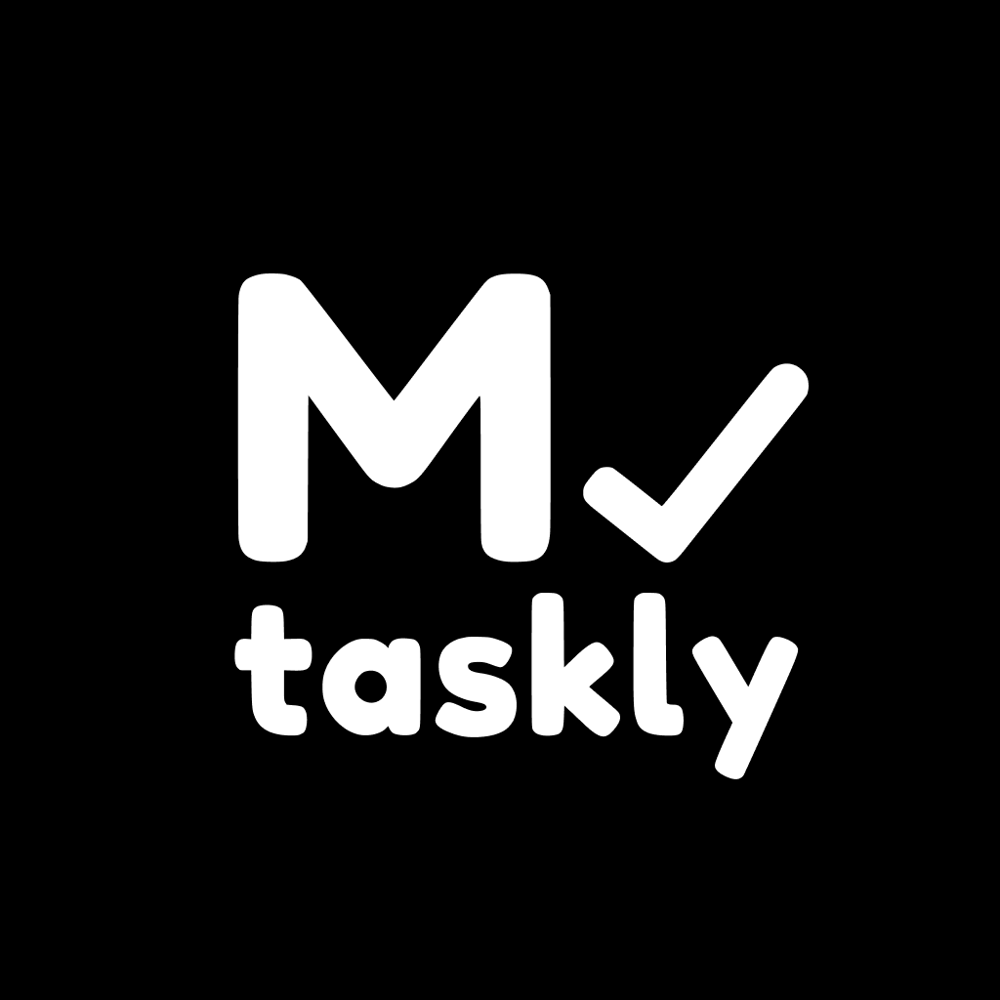
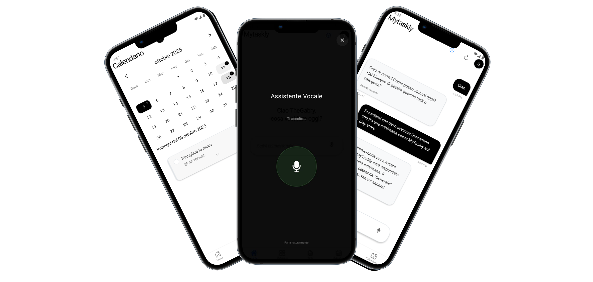
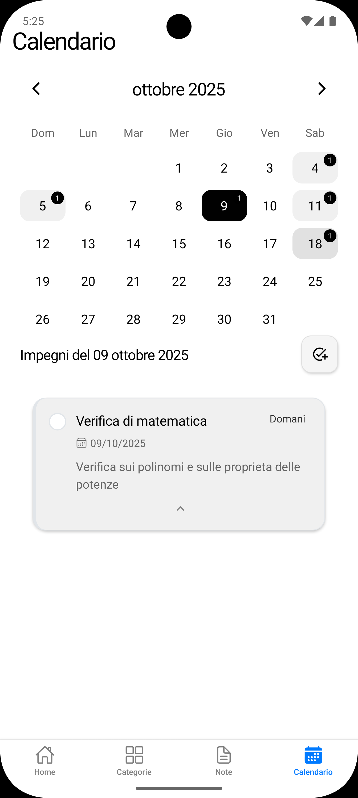
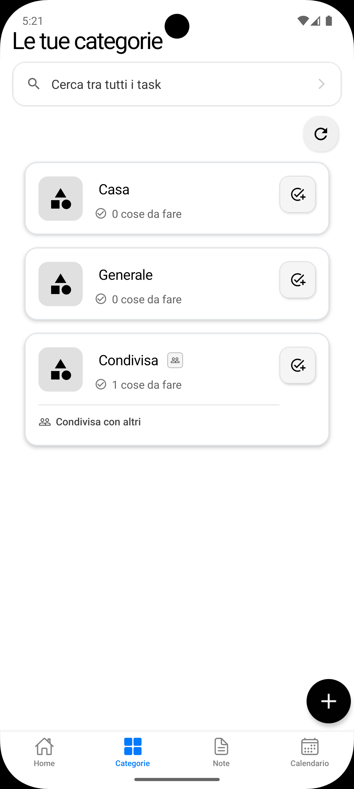
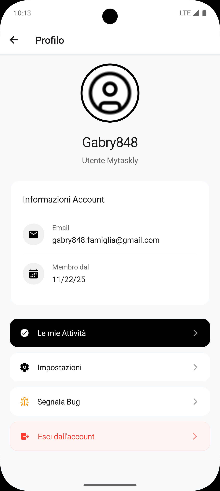

<div align="center">



# MyTaskly

## The Intelligent Task Management App with AI-Powered Voice Assistant

[](https://github.com/Gabry848/MyTaskly-app)
[](./LICENSE.md)
[](https://reactnative.dev/)
[](https://expo.dev/)
[](https://www.typescriptlang.org/)
[](https://github.com/Gabry848/MyTaskly-app)

[Quick Start](#quick-start-5-minutes) • [Features](#features) • [Screenshots](#screenshots) • [Docs](./docs) • [Contributing](#contributing) • [License](#license)

</div>

---

> 🤖 **Talk to your tasks.** MyTaskly combines intelligent AI assistance with powerful task management, letting you work smarter, not harder.



---

## 🌟 Why MyTaskly?

- **🤖 AI That Understands You** - Natural language conversations, voice commands, and smart suggestions
- **⚡ Incredibly Fast** - Real-time syncing with zero lag
- **🎨 Beautiful Design** - Minimalist UI with dark mode support
- **🔐 Privacy-First** - Your data is encrypted and always under your control
- **🌐 Multi-Platform** - iOS, Android, and Web with seamless sync
- **🎓 Easy to Use** - Interactive tutorial guides you through everything

**Built by Gabriel, a 16-year-old developer** over 11+ months of learning, coding, and iterating. [Read the story →](https://github.com/Gabry848)

---

## ✨ Features

| Category | Features |
|----------|----------|
| **🤖 AI Assistant** | Natural language chat • Voice commands with VAD • Smart suggestions • Real-time streaming responses |
| **📝 Task Management** | Rich editor • Custom categories • Shared tasks • Permission controls • Task templates |
| **📅 Calendar** | Built-in calendar view • Google Calendar sync • Smart scheduling |
| **🔔 Notifications** | Push reminders • Customizable alerts • Cross-device sync |
| **🎨 Design** | Minimalist UI • Dark mode • Smooth animations • Responsive layout |
| **🔐 Security** | Google Sign-In • Account management • End-to-end encryption |
| **🎓 Onboarding** | Interactive tutorial • Contextual help • Progress tracking |
| **🌐 Platform** | iOS • Android • Web (PWA) |

---

## Screenshots

| AI Assistant | Task Management | Voice Chat |
|:---:|:---:|:---:|
|  |  |  |
| **Smart Conversations** | **Powerful Organization** | **Voice Commands** |
| Calendar View | Category Management | Settings |
|  |  |  |
| **Visual Planning** | **Flexible Sharing** | **Full Control** |

---

## 🚀 Getting Started

### Quick Start (5 minutes)

```bash
git clone https://github.com/Gabry848/MyTaskly-app.git
cd MyTaskly-app && npm install
cp .env.example .env && npm start
```

### Prerequisites

- **Node.js** v18+ • **npm** or **yarn**
- **Expo CLI**: `npm install -g expo-cli` • **Git**
- **iOS**: macOS + Xcode 14+ (optional)
- **Android**: Android Studio + SDK 33+ (optional)

### Configuration

Create `.env` file:

```env
API_KEY=your_api_key_here
API_URL=your_backend_url_here
GOOGLE_WEB_CLIENT_ID=your_google_client_id
GOOGLE_ANDROID_CLIENT_ID=your_google_android_client_id
```

Place these files in root directory:

- `google-services.json` (Android)
- `GoogleService-Info.plist` (iOS, in ios folder)

### Run the App

| Platform | Command | Notes |
|----------|---------|-------|
| **Web** | `npm run web` | Instant preview |
| **iOS** | `npm run ios` | Requires macOS + Xcode |
| **Android** | `npm run android` | Requires Android Studio |
| **Interactive** | `npm start` | Choose platform from menu |

### Production Build

```bash
eas build --platform ios       # iOS only
eas build --platform android   # Android only
eas build --platform all       # Both platforms
```

📚 [Expo EAS Documentation](https://docs.expo.dev/build/introduction/)

---

## 📖 Usage

### Basic Task Management

1. **Create a Task**: Tap the "+" button on the home screen
2. **Set Details**: Add a title, description, due date, and category
3. **Save**: Your task is automatically synced to the cloud

### Using the AI Assistant

1. **Start a Chat**: Go to the Home tab
2. **Type or Speak**: Ask questions or give commands naturally
   - "Show me today's tasks"
   - "Create a task to buy groceries tomorrow"
   - "What should I focus on this week?"
3. **Voice Mode**: Tap the microphone icon for hands-free interaction

### Sharing Categories

1. **Open a Category**: Select the category you want to share
2. **Tap Share**: Use the share button
3. **Invite Users**: Enter email addresses or usernames
4. **Set Permissions**: Choose view-only or edit access

### Calendar Integration

1. **Connect Google Calendar**: Go to Settings → Google Calendar
2. **Authorize**: Sign in with your Google account
3. **Sync**: Your tasks will automatically appear in Google Calendar

---

## 🏗️ Architecture

MyTaskly is built with modern React Native architecture:

```
MyTaskly-app/
├── src/
│   ├── components/         # Reusable UI components
│   ├── navigation/         # Navigation structure and screens
│   │   └── screens/        # Main app screens
│   ├── services/           # API clients and business logic
│   ├── contexts/           # React Context providers
│   ├── constants/          # App constants and configurations
│   └── utils/              # Helper functions and utilities
├── assets/                 # Images, fonts, and other static assets
├── app.json                # Expo configuration
├── package.json            # Project dependencies
└── tsconfig.json           # TypeScript configuration
```

### Key Technologies

- **Frontend**: React Native 0.79, TypeScript
- **Navigation**: React Navigation 7
- **State Management**: React Context API + Async Storage
- **UI Components**: Custom components with React Native Reanimated
- **AI Integration**: Custom streaming LLM client
- **Audio**: Expo AV with custom Voice Activity Detection
- **Authentication**: Google Sign-In (@react-native-google-signin)
- **Notifications**: Expo Notifications
- **Calendar**: React Native Calendar + Google Calendar API
- **Data Sync**: Custom sync manager with offline support
- **Build Tool**: Expo EAS Build

---

## 🤝 Contributing

We love contributions! MyTaskly is an open-source project, and we welcome contributions from developers of all skill levels.

Please read our [CONTRIBUTING.md](./CONTRIBUTING.md) for details on:

- Code of Conduct
- Development workflow
- How to submit pull requests
- Coding standards and best practices

---

## 📝 Changelog

See [CHANGELOG.md](./CHANGELOG.md) for a detailed list of changes and version history.

---

## 📄 License

This project is licensed under the **MIT License** - see the [LICENSE.md](./LICENSE.md) file for details.

The MIT License allows you to:

- ✅ Use commercially
- ✅ Modify
- ✅ Distribute
- ✅ Private use

---

## 🌟 Support the Project

If you find MyTaskly helpful, consider:

- ⭐ **Starring the repository** on GitHub
- 🐛 **Reporting bugs** and requesting features
- 🔀 **Contributing code** or documentation
- 💬 **Sharing** with friends and colleagues
- ☕ **Supporting the developer** (links coming soon!)

---

## 👨‍💻 About the Developer

MyTaskly was created by **Gabriel** ([@Gabry848](https://github.com/Gabry848)), a 16-year-old developer passionate about creating tools that help people be more productive. This project represents over **11 months** of learning, coding, debugging, and iterating.

> "I built MyTaskly because I wanted to create something that would genuinely help people stay organized while showcasing the possibilities of combining AI with traditional productivity tools." - Gabriel

### Contact & Links

- **GitHub**: [@Gabry848](https://github.com/Gabry848)
- **Project Repository**: [MyTaskly-app](https://github.com/Gabry848/MyTaskly-app)
- **Issues & Bug Reports**: [GitHub Issues](https://github.com/Gabry848/MyTaskly-app/issues)

---

## 🙏 Acknowledgments

Special thanks to:

- The **React Native** and **Expo** teams for amazing frameworks
- The **open-source community** for inspiration and libraries
- **Beta testers** who provided valuable feedback
- Everyone who supported this project during development

---

## 📚 Documentation

For more detailed documentation, check out:

- [Installation Guide](./docs/installation.md) (coming soon)
- [API Documentation](./docs/api.md) (coming soon)
- [Development Guide](./docs/development.md) (coming soon)
- [Deployment Guide](./docs/deployment.md) (coming soon)

---

## 🐛 Known Issues & Roadmap

Check our [GitHub Issues](https://github.com/Gabry848/MyTaskly-app/issues) for:

- Current bugs and issues
- Feature requests
- Planned improvements
- Community discussions

### Coming Soon

- [ ] Desktop app (Electron)
- [ ] Widget support (iOS/Android)
- [ ] More AI models to choose from
- [ ] Task analytics and insights
- [ ] Pomodoro timer integration
- [ ] Habit tracking
- [ ] Team workspaces

---

<div align="center">

**Made with ❤️ by a 16-year-old developer**

If you like this project, don't forget to give it a ⭐!

[⬆ Back to Top](#mytaskly)

</div>
